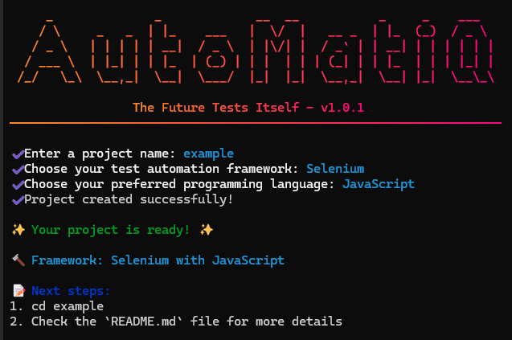

<h1 align="center"> AutoMatiQ-CLI </h1>

<h3 align="center"> Interactive CLI for Test Framework Setup with project scaffolding and configuration management. </h3>

<p align="center">
 
</p>

<p align="center">
   
   
   
   
</p>

---

<p align="center">
   
</p>

## Table of Contents

1. [Features](#features)
2. [Prerequisites](#prerequisites)
3. [Installation](#installation)
4. [Usage](#usage)
5. [License](#license)

## Features

- `Interactive project setup wizard`
- `Automated repository cloning`
- `Project structure initialization`

## Prerequisites

- `Node.js` (v20 or higher)

## Installation

You can install `automatiq-cli` globally using npm:

```bash
npm install -g automatiq-cli
```

## Usage

After installing globally, you can use the `automatiq` command to initialize a new project:

```bash
automatiq init
```

The CLI will guide you through the following steps:

1. Enter your project name
2. Choose your preferred framework (JavaScript/Java)

`Note: The project structure will be based on the selected template repository and includes complete test automation setup.`

## License

This project is licensed under the GPL License. See
the [LICENSE](https://github.com/harryvn/automatiq-cli/blob/main/LICENSE) file for details.
